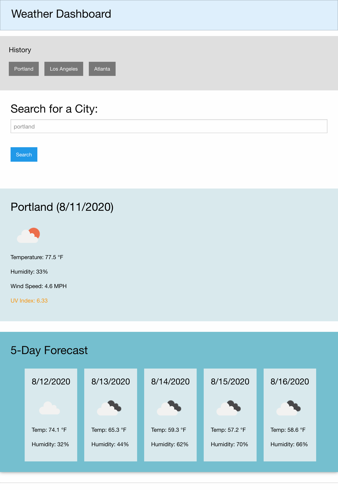

# 06 Server-Side APIs: Weather Dashboard

Deployed application:
https://kdoh52.github.io/hw-6/ 

Screenshot:

Description:
This web application is designed to allow a user to input a city and receive the current and forecasted weather information for it. This is done through the use of API's, specifically OpenWeather's.

Additionally, once a city has been searched, it is then added to the history section where it can be re-called easily. This is saved in local storage so it remains persistent through refreshes.

Technologies used:
HTML, CSS, JS, Jquery, Foundation, Moment.js

Contact:
kdoh52@gmail.com
